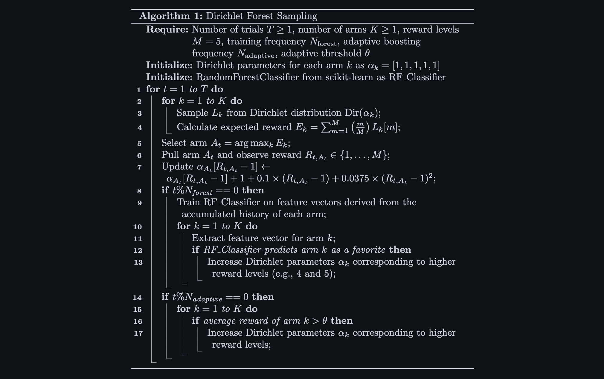
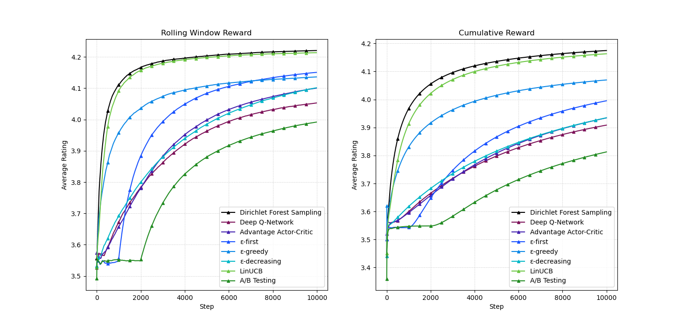

Previous work on bandit algorithms for bounded reward distributions has achieved logarithmic regret under classical assumptions, though the strongest guarantees require solving a convex optimization problem at each step. I propose a new bandit algorithm, "Dirichlet Forest Sampling," that avoids this computational burden. Offline evaluations on cold‐start content recommendation demonstrate that the proposed algorithm converges faster and achieves higher cumulative rewards than both traditional bandit policies and deep reinforcement learning methods.

To run it yourself, select simulation parameters and run `src/driver.py`. Ensure you have the necessary packages installed by referencing `requirements.txt`. The source code for the different bandit algorithms is in `src/agents.py`.

## Multi-Armed Bandit Problems

The Multi-Armed Bandit (MAB) problem is a one-state Markov decision process that models decision-making under uncertainty. It involves an agent repeatedly choosing from several options ("arms"), each providing a random reward drawn from a stationary distribution. The objective is to maximize cumulative reward by balancing exploration (trying different arms) and exploitation (selecting the arm with the highest expected reward). Too much exploration wastes time on suboptimal arms, while too much exploitation can miss better options.

MAB strategies are widely used to optimize decisions under uncertainty and address the cold start problem, where traditional machine learning and collaborative filtering methods struggle due to insufficient data or context for accurate predictions. For example, MAB strategies have been applied to dynamically select genres and songs in content recommendations (Spotify) [[1](https://research.atspotify.com/publications/explore-exploit-explain-personalizing-explainable-recommendations-with-bandits/)], optimize ad selection with limited data in online advertising (Facebook) [[2](https://dl.acm.org/doi/abs/10.1145/3442381.3450074)], and test headlines for user engagement (Yahoo) [[3](https://arxiv.org/abs/1908.06256)].  

Formalizing the $K$-armed bandit problem, let $K \in \mathbb{N}^+$ be the number of arms, $T \in \mathbb{N}^+$ be the number of turns, $A_t \in \{1,2,...,K\}$ be the action chosen at time $t$, and $R_{t,A_t}$ be the reward received at time $t$ for choosing action $A_t$, drawn from an unknown stationary distribution. At each time step $t$, the agent selects an action $A_t$ from the set of arms, and the chosen arm provides a reward $R_{t, A_t}$. The process is repeated for $T$ trials, and the agent's objective is to maximize the expected cumulative reward $\mathbb{E}\left[\Sigma_{t=1}^T R_{t, A_t} \right]$.

## Existing Bandit Algorithms

There are many existing bandit algorithms and deep RL algorithms that can be applied to MAB problems. 
- **$\epsilon$-first:** Begins with a pure exploration phase, selecting arms randomly for a fixed number of initial trials ($\epsilon$), before switching to a pure exploitation phase, repeatedly selecting the best-known arm.
- **$\epsilon$-greedy:** Balances exploration and exploitation by choosing a random arm with a probability of $\epsilon$ and the best-known arm with a probability of $(1−\epsilon)$ [[4]](https://link.springer.com/article/10.1023/A:1013689704352).
- **$\epsilon$-decreasing:** Starts with a high exploration rate that decreases over time, allowing for more exploitation in later trials.
- **LinUCB:** Uses a linear model to estimate rewards based on contextual information and selects the arm with the highest upper confidence bound on the estimated reward [[5]](https://dl.acm.org/doi/10.1145/1772690.1772758).
- **Thompson Sampling:** A Bayesian algorithm that models each arm's reward with a probability distribution, sampling from these distributions to decide which arm to pull, favoring arms with higher uncertainty [[6]](https://www.jstor.org/stable/2332286).
- **Advantage Actor-Critic (A2C):** Uses separate models for the policy (actor) and value function (critic), balancing immediate rewards and long-term value through stable learning.
- **Deep Q-Learning:** Uses deep neural networks to approximate Q-values (the expected reward of taking an action in a given state) and uses these approximations to guide action selection.

## Improved Dirichlet Sampling with Random Forests

Existing algorithms for bounded reward distributions are either suboptimal or require solving an optimization problem at each step [[7](http://proceedings.mlr.press/v19/garivier11a/garivier11a.pdf)]. Dirichlet parameters have been proposed as an extension of Thompson Sampling for Bernoulli rewards to bounded multinomial reward distributions [[8](https://arxiv.org/abs/2111.09724)], addressing the need for quick online decision-making without the computational burden of constant optimization [[9](https://proceedings.mlr.press/v117/riou20a.html)]. 

Extending this concept, Dirichlet Forest Sampling integrates a random forest classifier to adjust Dirichlet parameters based on observed performance in scenarios where specific user data is sparse, yet general user tendencies (e.g., genre biases) are apparent. In the context of Netflix genre recommendations, this approach accelerates convergence toward the optimal strategy. Additionally, the algorithm applies a nonlinear update to the Dirichlet parameters, calibrated to the reward scale.

## Data Mining for User Profiles

A subset of the [Netflix Prize Data](https://www.kaggle.com/datasets/netflix-inc/netflix-prize-data)
 (~8 million data points) was processed to model user rating tendencies based on broader preferences, compensating for the lack of detailed individual data. Users were categorized into five profiles:

1. **Average Viewers**: Users with average ratings across genres.
2. **Genre Enjoyers**: Users with high ratings for a single genre.
3. **Multiple Genre Enjoyers**: Users who favor multiple genres.
4. **Niche Genre Loyalists**: Users loyal to a niche genre, with lower ratings for others.
5. **Multiple Niche Genre Loyalists**: Users loyal to several niche genres, with selectively higher ratings.

This categorization defines a 27-armed bandit problem (one arm per genre) with virtual users as dynamic environments. An ensemble of 100 simulated users, proportional to the observed data distribution, was used to evaluate each algorithm over 10,000 steps, with performance measured by total cumulative rewards and rolling window averages. 

## Comparing Agent Performances

The Dirichlet Forest Sampling algorithm was benchmarked against other strategies, yielding the following average reward rankings:
1. 🥇 **Dirichlet Forest Sampling** - 4.17
2. 🥈 **LinUCB** - 4.16
3. 🥉 **ε-greedy** - 4.07
4. **ε-first** - 4.00
5. **ε-decreasing** - 3.93
6. **Advantage Actor-Critic** - 3.92
7. **Deep Q-Network** - 3.91
8. **A/B Testing** - 3.81

Strategies like A/B testing and ε-first exhibit initial randomness during exploration, stabilizing only after this phase ends. Deep reinforcement learning approaches, while effective, tend to converge more slowly and do not consistently identify the optimal strategy across diverse user profiles. ε-greedy quickly identifies a good strategy but is eventually surpassed by ε-first due to its more extensive initial exploration. LinUCB performs well, but Dirichlet Forest Sampling converges faster and maintains consistently higher average rewards throughout the evaluation.

## Works Cited

1. **McInerney, J., Lacker, B., Hansen, S., Higley, K., Bouchard, H., Gruson, A., & Mehrotra, R. (2024).** *Exploring Personalized Recommendations with Bandits.* Spotify Research.

2. **Avadhanula, V., Colini-Baldeschi, R., Leonardi, S., Sankararaman, K. A., & Schrijvers, O. (2021).** *Stochastic Bandits for Multi-Platform Budget Optimization in Online Advertising.* The Web Conference, 2021.

3. **Mao, Y., Chen, M., Wagle, A., Pan, J., Natkovich, M., & Matheson, D. (2019).** *A Batched Multi-Armed Bandit Approach to News Headline Testing.* IEEE BigData, 2018.

4. **Auer, P., Cesa-Bianchi, N., & Fischer, P. (2002).** *Finite-time Analysis of the Multiarmed Bandit Problem.* Machine Learning, 47(3), 235-256.

5. **Li, L., Chu, W., Langford, J., & Schapire, R. E. (2010).** *LinUCB: A Contextual-Bandit Approach to Personalized News Article Recommendation.* Nineteenth International Conference on World Wide Web (WWW 2010), Raleigh, NC, USA.

6. **Thompson, W. R. (1933).** *On the likelihood that one unknown probability exceeds another in view of the evidence of two samples.* Biometrika, 25(3/4), 285-294.

7. **Garivier, A., & Cappé, O. (2011).** *The KL-UCB Algorithm for Bounded Stochastic Bandits and Beyond.* Conference On Learning Theory, 24, 359-376.
   
8. **Baudry, D., Saux, P., & Maillard, O.-A. (2021).** *From Optimality to Robustness: Dirichlet Sampling Strategies in Stochastic Bandits*, NeurIPS 2021, Sydney, Australia.

9. **Riou, C., & Honda, J. (2020).** *Bandit Algorithms Based on Thompson Sampling for Bounded Reward Distributions.* Proceedings of the 31st International Conference on Algorithmic Learning Theory, PMLR 117:777-826.

