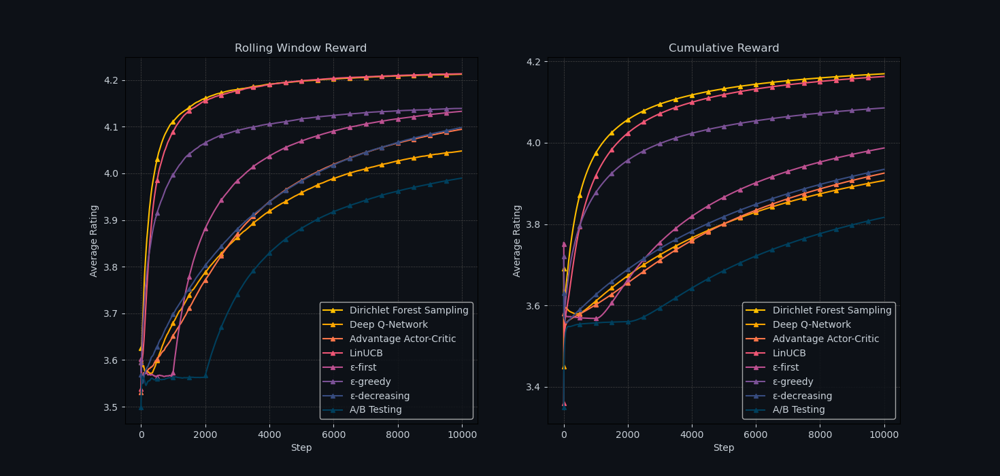

I propose a new bandit algorithm, "Dirichlet Forest Sampling," building on previous work for bounded reward distributions without the computational burden of optimization at each step. This algorithm uses a scikit-learn random forest classifier and a nonlinear update mechanism to Dirichlet parameters, sampling to approximate the estimated value. It excels in scenarios with general user tendencies but no specific context, making it ideal for cold-start content recommendations. I model user rating tendencies using Netflix Prize data in a 27-armed bandit scenario. Benchmarking against traditional bandits (e.g., LinUCB, $\epsilon$-greedy) and PyTorch-based deep reinforcement learning methods (e.g., Deep Q-Learning, Advantage Actor-Critic), I demonstrate faster convergence and maximized cumulative rewards.

To run it yourself, select simulation parameters and run `src/driver.py`. Ensure you have the necessary packages installed by referencing `requirements.txt`. The source code for the different bandit algorithms is in `src/agents.py`.

## Multi-Armed Bandit Problems

The Multi-Armed Bandit (MAB) problem, a one-state Markov decision process, is a powerful framework in decision theory and reinforcement learning (RL). It describes an agent choosing among multiple options ("arms") in a series of trials to maximize cumulative reward. Focusing on stochastic and stationary reward distributions, each arm provides a random reward from a time-invariant distribution. The agent's goal is to identify the arm with the highest expected reward, balancing exploration (trying different arms) and exploitation (choosing the best-known arm). Too much exploration wastes time on suboptimal arms, while too much exploitation can miss better options. Optimizing total reward requires balancing these strategies effectively.

MAB strategies are widely used across industries to optimize decisions under uncertainty and address the cold start problem, where traditional machine learning and collaborative filtering methods struggle due to insufficient data or context for accurate predictions. In content recommendation systems like Spotify's, MAB algorithms dynamically select genres and songs based on real-time user interactions [[1](https://research.atspotify.com/publications/explore-exploit-explain-personalizing-explainable-recommendations-with-bandits/)]. In online advertising, companies like Facebook use MAB algorithms to optimize ad selection with limited initial data [[2](https://dl.acm.org/doi/abs/10.1145/3442381.3450074)]. Yahoo uses MAB algorithms to test headlines for user engagement [[3](https://arxiv.org/abs/1908.06256)].

Formalizing the $K$-armed bandit problem, let $K \in \mathbb{N}^+$ be the number of arms, $T \in \mathbb{N}^+$ be the number of turns, $A_t \in \{1,2,...,K\}$ be the action chosen at time $t$, and $R_{t,A_t}$ be the reward received at time $t$ for choosing action $A_t$, drawn from an unknown stationary distribution. At each time step $t$, the agent selects an action $A_t$ from the set of arms, and the chosen arm provides a reward $R_{t, A_t}$. The process is repeated for $T$ trials, and the agent's objective is to maximize the expected cumulative reward $\mathbb{E}\left[\Sigma_{t=1}^T R_{t, A_t} \right]$.

## Existing Bandit Algorithms

There are many existing bandit algorithms and deep RL algorithms that can be applied to MAB problems. 
- **$\epsilon$-First:** Begins with a pure exploration phase, selecting arms randomly for a fixed number of initial trials ($\epsilon$), before switching to a pure exploitation phase, repeatedly selecting the best-known arm.
- **$\epsilon$-Greedy:** Balances exploration and exploitation by choosing a random arm with a probability of $\epsilon$ and the best-known arm with a probability of $(1−\epsilon)$ [[4]](https://link.springer.com/article/10.1023/A:1013689704352).
- **$\epsilon$-Decreasing:** Starts with a high exploration rate that decreases over time, allowing for more exploitation in later trials.
- **LinUCB:** Uses a linear model to estimate rewards based on contextual information and selects the arm with the highest upper confidence bound on the estimated reward [[5]](https://dl.acm.org/doi/10.1145/1772690.1772758).
- **Thompson Sampling:** A Bayesian algorithm that models each arm's reward with a probability distribution, sampling from these distributions to decide which arm to pull, favoring arms with higher uncertainty [[6]](https://www.jstor.org/stable/2332286).
- **Advantage Actor-Critic (A2C):** Uses separate models for the policy (actor) and value function (critic), balancing immediate rewards and long-term value through stable learning.
- **Deep Q-Learning:** Uses deep neural networks to approximate Q-values (the expected reward of taking an action in a given state) and uses these approximations to guide action selection.

## Improved Dirichlet Sampling with Random Forests

Existing algorithms for bounded reward distributions are either suboptimal or require solving an optimization problem at each step [[7](http://proceedings.mlr.press/v19/garivier11a/garivier11a.pdf)]. Dirichlet parameters have been proposed as an extension of Thompson Sampling for Bernoulli rewards to bounded multinomial reward distributions [[8](https://arxiv.org/abs/2111.09724)], addressing the need for quick online decision-making without the computational burden of constant optimization [[9](https://proceedings.mlr.press/v117/riou20a.html)]. Dirichlet parameters represent the probabilities associated with each possible reward level for each arm, allowing for efficient sampling and updating of beliefs. 

I extend this concept by integrating a random forest classifier to further adjust Dirichlet parameters based on observed performance in contexts where we ***lack specific user data but know general tendencies*** (e.g., users being biased towards favorite genres). Specifically, in Netflix genre recommendations, it accelerates convergence to the optimal strategy, maximizing cumulative rewards more efficiently than traditional algorithms. My algorithm, Dirichlet Forest Sampling, also applies a nonlinear update to the Dirichlet parameters, fitted to a reward of 1 for a value of 1 and 2 for a value of 5.

## Data Mining for User Profiles

To benchmark the Dirichlet Forest Sampling algorithm against other bandit and deep RL strategies, I cleaned and processed a subset of the [Netflix Prize Data](https://www.kaggle.com/datasets/netflix-inc/netflix-prize-data) (~8 million datapoints) to model user rating tendencies within a framework that lacks specific user data but leverages broader user preferences. The users were categorized into five distinct profiles based on their rating patterns:
1. **Average Viewers**: Users with average ratings across genres.
2. **Genre Enjoyers**: Users with high ratings for a single genre.
3. **Multiple Genre Enjoyers**: Users who favor multiple genres.
4. **Niche Genre Loyalists**: Users loyal to a niche genre, with lower ratings for others.
5. **Multiple Niche Genre Loyalists**: Users loyal to several niche genres, with selective higher ratings.

This transformed the setup into a 27-armed bandit problem, with each arm corresponding to a genre and the users serving as dynamic environments. An ensemble of 100 virtual users, reflecting proportions observed in the dataset, was constructed. Each algorithm was run on this ensemble for 10,000 steps, analyzing performance and stability through a total cumulative reward and rolling window average. 

## Comparing Agent Performances

The Dirichlet Forest Sampling algorithm was benchmarked against other strategies, with the results summarized in the following rankings based on average rewards:
1. 🥇 **Dirichlet Forest Sampling** - 4.17
2. 🥈 **LinUCB** - 4.16
3. 🥉 **ε-greedy** - 4.07
4. **ε-first** - 4.00
5. **ε-decreasing** - 3.93
6. **Advantage Actor-Critic** - 3.92
7. **Deep Q-Network** - 3.91
8. **A/B Testing** - 3.81

Strategies like A/B testing and ε-first show random behavior initially, stabilizing only after their exploration phases end. Both deep RL methods, while capable of identifying effective strategies, exhibit slower convergence and fail to consistently find the optimal strategy for different users. ε-greedy quickly identifies a good strategy but is eventually surpassed by ε-first due to its more extensive initial exploration. LinUCB performs well, but ***Dirichlet Forest Sampling demonstrates the best performance***, converging to the optimal strategy faster than LinUCB in the rolling window analysis and maintaining a consistently higher average reward at each timestep. 

## Works Cited

1. **McInerney, J., Lacker, B., Hansen, S., Higley, K., Bouchard, H., Gruson, A., & Mehrotra, R. (2024).** *Exploring Personalized Recommendations with Bandits.* Spotify Research.

2. **Avadhanula, V., Colini-Baldeschi, R., Leonardi, S., Sankararaman, K. A., & Schrijvers, O. (2021).** *Stochastic Bandits for Multi-Platform Budget Optimization in Online Advertising.* The Web Conference, 2021.

3. **Mao, Y., Chen, M., Wagle, A., Pan, J., Natkovich, M., & Matheson, D. (2019).** *A Batched Multi-Armed Bandit Approach to News Headline Testing.* IEEE BigData, 2018.

4. **Auer, P., Cesa-Bianchi, N., & Fischer, P. (2002).** *Finite-time Analysis of the Multiarmed Bandit Problem.* Machine Learning, 47(3), 235-256.

5. **Li, L., Chu, W., Langford, J., & Schapire, R. E. (2010).** *LinUCB: A Contextual-Bandit Approach to Personalized News Article Recommendation.* Nineteenth International Conference on World Wide Web (WWW 2010), Raleigh, NC, USA.

6. **Thompson, W. R. (1933).** *On the likelihood that one unknown probability exceeds another in view of the evidence of two samples.* Biometrika, 25(3/4), 285-294.

7. **Garivier, A., & Cappé, O. (2011).** *The KL-UCB Algorithm for Bounded Stochastic Bandits and Beyond.* Conference On Learning Theory, 24, 359-376.
   
8. **Baudry, D., Saux, P., & Maillard, O.-A. (2021).** *From Optimality to Robustness: Dirichlet Sampling Strategies in Stochastic Bandits*, NeurIPS 2021, Sydney, Australia.

9. **Riou, C., & Honda, J. (2020).** *Bandit Algorithms Based on Thompson Sampling for Bounded Reward Distributions.* Proceedings of the 31st International Conference on Algorithmic Learning Theory, PMLR 117:777-826.

